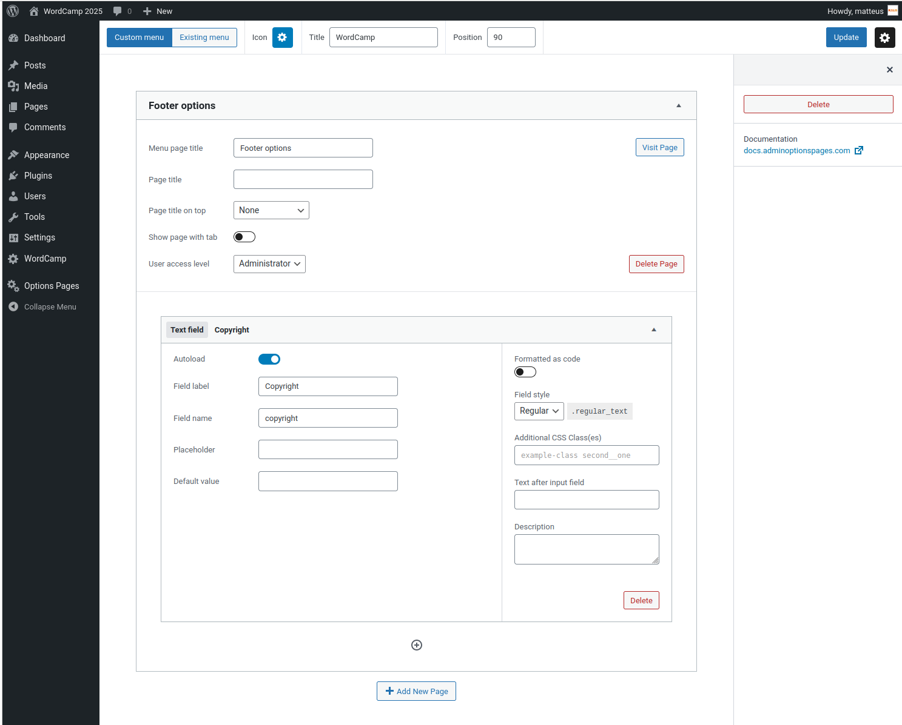

# 🧱 Zadanie nr 090 – WordCamp Options Page

## 🎯 Cel

Stworzyć własną globalną stronę opcji w kokpicie WordPressa przy użyciu wtyczki **Admin Options Pages**. Dzięki temu umożliwimy edycję treści stopki (np. tekstu copyright) bez edycji kodu szablonu.

---

## 🔌 Wymagania

Zainstalowana i aktywna wtyczka:  
🔗 [Admin Options Pages – by Johannes van Poelgeest](https://wordpress.org/plugins/admin-options-pages/)

---

## 🧭 Krok 1: Utwórz stronę opcji

1. Przejdź do **Options Pages > Add New Page**.
2. Wypełnij podstawowe pola zgodnie z poniższym:
   - **Custom menu**: zaznaczone
   - **Title**: `WordCamp`
   - **Position**: `90` (aby menu pojawiło się nisko)
   - **Menu page title**: `Website options`
   - **User access level**: `Administrator`

3. Zapisz stronę klikając **Update**.

---

## 🧾 Krok 2: Dodaj pole tekstowe do stopki

1. Kliknij **Plus**.
2. Wybierz typ pola: `Text field`
3. Uzupełnij pola:
   - **Field label**: `Copyright`
   - **Field name**: `copyright`
   - **Autoload**: ✅ włączone

4. Zapisz.

Przykład: `plugin_setup.png` – ten zrzut pokazuje przykładową konfigurację.



---

## 🖥️ Krok 3: Wyświetl tekst `copyright` w motywie

W pliku `footer.php` (lub `template-parts/footer.php`) wstaw:

```php
<footer>
  &copy; 2025 Moje Imię. Wszelkie prawa zastrzeżone. <?php echo get_option('copyright'); ?>
</footer>
```

Dzięki temu treść będzie pobierana dynamicznie z panelu administratora.

---

## ⭐ Zadanie z gwiazdką – edycja tytułu i menu

Rozszerz stronę opcji o możliwość edycji dodatkowych elementów:

- dodaj pole do zmiany **tytułu strony** (np. nagłówka sekcji),
- dodaj pole lub pola do definiowania **elementów menu** w stopce lub nagłówku.

Zastanów się, jak można je później wykorzystać w motywie - tak, aby treść była łatwa do edytowania przez administratora.
